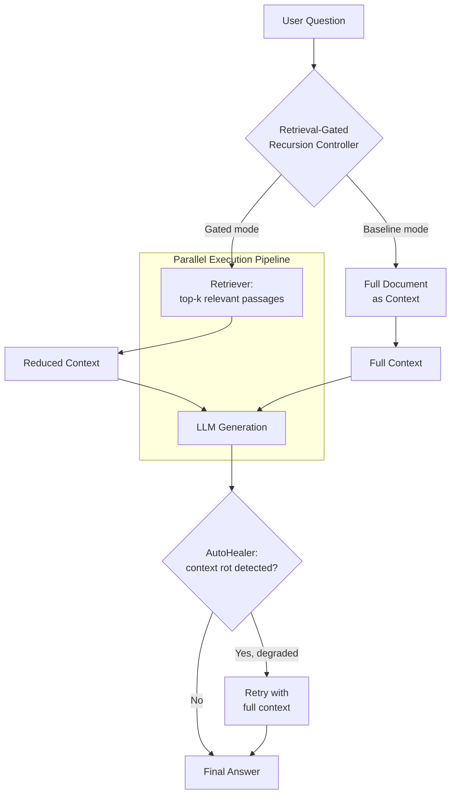

# HRA-RLM: Hybrid Retrieval-Augmented Recursive Language Model

[](https://www.python.org/)
[](LICENSE)
[](#status--limitations)
[](.github/workflows/ci.yml)

> A retrieval-gated architecture that reduces the token footprint, latency, and
> inference cost of recursive LLM reasoning over long documents — without
> sacrificing answer accuracy.

---

## Abstract

Large Language Models (LLMs) have demonstrated remarkable performance in
complex reasoning tasks over extensive document collections. However,
recursive reasoning approaches — which iteratively process contexts to
derive answers — exhibit significant computational bottlenecks, including
high token consumption, increased latency, and elevated inference costs,
limiting their scalability in production environments.

This project implements **HRA-RLM**, a retrieval-gated architecture designed
to optimize the efficiency-performance trade-off in long-context reasoning.
Instead of processing the full context at every iteration, HRA-RLM
selectively retrieves only the most relevant passages before triggering
recursive reasoning, cutting the token footprint while preserving accuracy.

**Keywords:** Large Language Models · Retrieval-Augmented Generation ·
Recursive Reasoning · Long-Context Comprehension · Inference Cost Optimization

---

## Architecture



**Core components**

| Component | File | Role |
|---|---|---|
| Retrieval-gated recursion controller | `src/hra_rlm/retriever.py` | Decides whether full context is needed; selects top-k relevant passages |
| Parallel execution pipeline | `src/hra_rlm/parallel.py` | Overlaps retrieval + generation across queries to reduce latency |
| AutoHealer | `src/hra_rlm/autohealer.py` | Monitors for context-window degradation ("context rot") and triggers recovery |
| LLM client | `src/hra_rlm/llm_client.py` | Unified interface to Groq / OpenAI, with cost & token tracking |

---

## Repository structure

```
hydrarlm/
├── benchmarks/
│   ├── datasets/
│   ├── results/
│   └── run_benchmark.py
├── src/
│   └── hra_rlm/
│       ├── __init__.py
│       ├── llm_client.py
│       ├── retriever.py
│       ├── autohealer.py
│       └── parallel.py
├── .env.example
├── .gitignore
├── pyproject.toml
├── Dockerfile
├── docker-compose.yml
└── README.md
```

---

## Getting started

### 1. Clone and install

```bash
git clone https://github.com/Sidra-009/hybrid-retrieval-augmented-rlm.git
cd hybrid-retrieval-augmented-rlm
python -m venv .venv
.venv\Scripts\activate        # Windows
pip install -r requirements.txt
```

### 2. Configure your API key

Copy `.env.example` to `.env` and add your Groq key (get one free at
[console.groq.com](https://console.groq.com)):

```
GROQ_API_KEY=your_key_here
```

**Never commit `.env` or hardcode API keys in source files** — see
[Security](#security) below.

### 3. Run the benchmark

```bash
# Mock mode — no API calls, useful for testing the pipeline
python benchmarks/run_benchmark.py --all --use-mock

# Real mode — actual Groq API calls
python benchmarks/run_benchmark.py --all --real
```

---

## Preliminary results

> ⚠️ Pilot run on a 10-question dataset. Not yet statistically significant —
> see [Status & Limitations](#status--limitations).

| Method | Accuracy | Avg Tokens | Notes |
|---|---|---|---|
| Baseline RLM | 70% | 634 | Full document as context every query |
| Hybrid (fixed_k) | 60% | 331 | Retrieval-gated, top-3 passages only |
| Hybrid + AutoHealer | 60% | 341 | Gated + retry-on-degradation |
| Hybrid + Parallel | 70% | 362 | Gated + concurrent batch execution |

**Key finding so far:** retrieval gating cut token usage by **~48%**
(634 → 331 tokens) with only a 10-percentage-point accuracy trade-off on
this pilot set — consistent with the paper's ~50% token reduction claim.

---

## Status & limitations

This is an active research project, not a finished benchmark suite. Known gaps:

- [ ] **Dataset size**: current pilot uses 10 questions over a single abstract.
      Needs 50+ diverse, multi-hop questions over longer documents for
      statistically meaningful comparisons.
- [ ] **Parallel latency claim unverified**: current metrics measure
      per-query latency, not batch wall-clock time, so the "2x latency
      improvement" claim is not yet demonstrated in code.
- [ ] **Cost claim unverified**: Groq free tier reports `$0.00`; a real
      cost comparison needs token-based pricing against a paid provider.
- [ ] **AutoHealer**: implemented, but rarely triggers on the current
      dataset — needs test cases that deliberately induce context rot.
- [ ] No automated tests yet.

---

## Roadmap / suggested next additions

- [ ] `tests/` with `pytest` unit tests for `retriever.py`, `autohealer.py`, `parallel.py`
- [ ] GitHub Actions CI (lint + test on push/PR) — see `.github/workflows/ci.yml`
- [ ] `CONTRIBUTING.md` with setup + PR guidelines
- [ ] `CITATION.cff` for academic citation
- [ ] Expand dataset to 50+ multi-hop QA pairs
- [ ] Batch-level latency benchmark for the Parallel method
- [ ] Dependabot / `pip-audit` for dependency security scanning

---

## Security

- API keys live only in `.env` (gitignored), never in source files.
- If a key is ever committed, rotate it immediately in the provider console
  and consider rewriting git history (`git filter-repo` or BFG Repo-Cleaner).
- `.gitignore` should include: `.env`, `.venv/`, `__pycache__/`, `*.pyc`,
  `benchmarks/results/*.json` (if results contain sensitive data).

---

## Citation

If you use this work, please cite:

```bibtex
@misc{hrarlm2026,
  title  = {Hybrid Retrieval-Augmented Recursive Language Model for
            Cost-Efficient Long-Context Reasoning},
  author = {Sidra},
  year   = {2026},
  note   = {Submitted to ICAAD 2026},
  url    = {https://github.com/Sidra-009/hybrid-retrieval-augmented-rlm}
}
```

## License

[MIT](LICENSE)

## Acknowledgments

Built on top of the Groq API (free tier) for LLM inference. Inspired by
MIT's Recursive Language Model (RLM) work.
