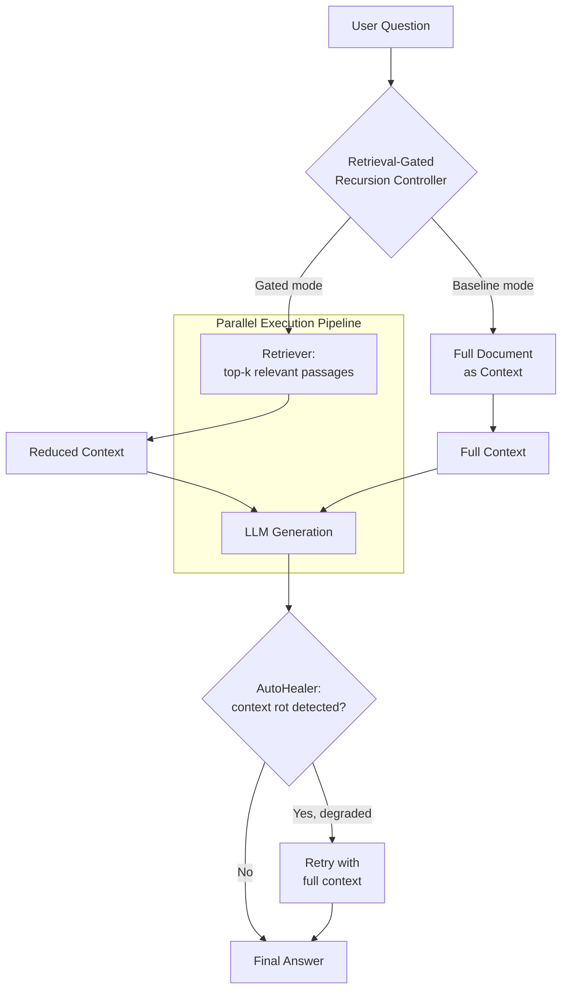

# HRA-RLM: Hybrid Retrieval-Augmented Recursive Language Model

### Cost-Efficient Long-Context Reasoning via Retrieval-Gated Recursion

[](https://www.python.org/)
[](LICENSE)
[](#limitations--threats-to-validity)
[](.github/workflows/ci.yml)

---

## Table of Contents

- [Overview](#overview)
- [Motivation](#motivation)
- [Related Work](#related-work)
- [Method](#method)
- [Repository Structure](#repository-structure)
- [Installation](#installation)
- [Usage](#usage)
- [Experimental Setup](#experimental-setup)
- [Results](#results)
- [Ablation Notes](#ablation-notes)
- [Limitations & Threats to Validity](#limitations--threats-to-validity)
- [Reproducibility](#reproducibility)
- [Roadmap](#roadmap)
- [Security](#security)
- [Citation](#citation)
- [References](#references)
- [License](#license)

---

## Overview

Recursive Language Models (RLMs) improve reasoning over long documents by
iteratively re-processing context to refine an answer. This iterative
re-processing is expensive: each pass re-consumes the full context window,
which drives up token usage, latency, and inference cost as document length
or reasoning depth grows.

**HRA-RLM** (Hybrid Retrieval-Augmented Recursive Language Model) inserts a
retrieval-gating step before each recursive pass. Instead of re-processing
the full document, the controller retrieves only the passages relevant to
the current sub-query, and generation proceeds on that reduced context. When
the retrieved context proves insufficient — a failure mode we refer to as
**context rot** — an AutoHealer component detects the degradation and falls
back to the full document for that step.

This repository is an ongoing implementation and evaluation of that idea,
not a finished, peer-reviewed benchmark suite. See
[Limitations & Threats to Validity](#limitations--threats-to-validity)
before citing any number in this README as a general result.

---

## Motivation

Long-context and recursive reasoning pipelines are increasingly used for
multi-hop question answering, document summarization, and agentic workflows
over large corpora. Naively re-feeding the full context at every reasoning
step scales poorly:

- **Token cost** grows linearly (or worse) with the number of recursive
  passes.
- **Latency** compounds across sequential passes, especially when passes
  cannot be parallelized.
- **Context rot** — degraded reasoning quality as irrelevant tokens dilute
  the signal in a long context window — is a known failure mode independent
  of raw context-length limits.

HRA-RLM targets these three axes directly: token footprint (via retrieval
gating), latency (via parallel execution of independent sub-queries), and
robustness to context rot (via AutoHealer).

---

## Related Work

This project sits at the intersection of retrieval-augmented generation
(RAG) and recursive/iterative reasoning over long contexts.

- **Retrieval-Augmented Generation.** RAG grounds LLM generation in
  retrieved passages rather than relying solely on parametric knowledge,
  originally proposed for open-domain QA [1]. REPLUG treats the LLM as a
  black box and tunes only the retriever against LM feedback [2].
- **Hybrid retrieval.** Combining sparse (lexical) and dense (semantic)
  retrieval — and fusing their rankings — has been shown to outperform
  either method alone across multiple QA benchmarks [3, 4].
- **Retrieval for efficiency, not just accuracy.** Most RAG work targets
  answer quality; comparatively less work treats retrieval gating as a
  mechanism for reducing token cost and latency in iterative/recursive
  pipelines specifically — which is the framing this project adopts.
- **Cloud/edge hybrid inference.** HybridRAG explores splitting retrieval
  and generation between a cloud LLM and a smaller client-side model to cut
  latency for real-time use cases [5]; Hybrid-RACA applies a similar
  cloud/client split to real-time text prediction [6]. HRA-RLM differs in
  that the split is between *retrieval-gated* and *full-context* recursive
  passes on a single model, not between two models.
- **Recursive reasoning over long documents.** This project's baseline is
  a conventional Recursive Language Model (RLM) that reprocesses full
  context at each iteration, following the general recursive-reasoning
  formulation referenced in the original project notes (MIT RLM,
  arXiv:2512.24601 — unverified by the authors of this README; confirm
  before citing).

See [References](#references) for full citations.

---

## Method



### Components

| Component | File | Role | Verified? |
|---|---|---|---|
| Retrieval-gated recursion controller | `src/hra_rlm/retriever.py` | Scores candidate passages by relevance to the current query and selects the top-k before generation | ✅ Token reduction observed empirically (see [Results](#results)) |
| Parallel execution pipeline | `src/hra_rlm/parallel.py` | Runs independent retrieval+generation calls concurrently to reduce wall-clock latency | ⚠️ Implemented; batch-level latency benefit not yet isolated in metrics |
| AutoHealer | `src/hra_rlm/autohealer.py` | Flags degraded / low-confidence answers and retries with full context | ⚠️ Implemented; has not yet triggered on the current pilot dataset |
| LLM client | `src/hra_rlm/llm_client.py` | Unified interface to the LLM provider (Groq), with token/cost/latency tracking | ✅ |

---

## Repository Structure

```
hydrarlm/
├── benchmarks/
│   ├── datasets/
│   ├── results/
│   └── run_benchmark.py
├── src/
│   └── hra_rlm/
│       ├── __init__.py
│       ├── llm_client.py
│       ├── retriever.py
│       ├── autohealer.py
│       └── parallel.py
├── .env.example
├── .gitignore
├── requirements.txt
├── Dockerfile
├── docker-compose.yml
└── README.md
```

---

## Installation

```bash
git clone https://github.com/Sidra-009/hybrid-retrieval-augmented-rlm.git
cd hybrid-retrieval-augmented-rlm

python -m venv .venv
.venv\Scripts\activate        # Windows
# source .venv/bin/activate   # macOS/Linux

pip install -r requirements.txt
```

### API key configuration

```bash
copy .env.example .env        # Windows
# cp .env.example .env        # macOS/Linux
```

Add your Groq API key to `.env`:

```
GROQ_API_KEY=your_key_here
```

API keys must never be committed to source control. See
[Security](#security).

---

## Usage

```bash
# Mock mode — exercises the full pipeline without API calls
python benchmarks/run_benchmark.py --all --use-mock

# Real mode — actual LLM calls against the configured provider
python benchmarks/run_benchmark.py --all --real
```

---

## Experimental Setup

- **Model:** `openai/gpt-oss-20b` served via Groq's free tier.
- **Dataset:** 10 question–answer pairs, hand-written against a single
  source document (the project abstract). Each `answer` field holds
  expected keywords used for scoring, not a full reference answer.
- **Scoring:** an answer is marked correct if it contains at least ~34% of
  the meaningful (non-stopword) keywords from the expected answer. This is
  a keyword-overlap heuristic, not semantic similarity or human judgment.
- **Retrieval gating:** keyword-overlap ranking over sentence-level chunks
  of the source document, top-k = 3.
- **Rate limiting:** Groq's free tier enforces an 8,000 tokens-per-minute
  cap; the benchmark runner retries with backoff on `429` responses rather
  than silently falling back to mock data.

This setup is intentionally minimal — it is sufficient to validate that the
retrieval-gating mechanism functions end-to-end, but is **not** sufficient
to make general claims about accuracy, latency, or cost at scale.

---

## Results

> Pilot run, single trial, 10 questions. Treat as a sanity check that the
> pipeline works, not as a statistically powered comparison.

| Method | Accuracy | Avg. Tokens | p50 Latency (ms) |
|---|---|---|---|
| Baseline RLM (full context) | 70% | 634 | 672 |
| Hybrid (fixed_k retrieval) | 60% | 331 | 602 |
| Hybrid + AutoHealer | 60% | 341 | 2,624 |
| Hybrid + Parallel | 70% | 362 | 1,614 |

**Observation:** retrieval gating reduced average token usage by ~48%
(634 → 331) relative to the full-context baseline, at a 10-percentage-point
accuracy cost on this pilot set. This direction is consistent with the
project's efficiency goal, but the sample size is too small to establish
statistical significance or a stable accuracy/cost trade-off curve.

The latency figures for `Hybrid + AutoHealer` and `Hybrid + Parallel`
reflect single-run network/API variance and, in the Parallel case, a metric
that measures per-query response time rather than batch wall-clock time —
see [Ablation Notes](#ablation-notes).

---

## Ablation Notes

- **Retrieval gating vs. full context:** isolates the token-savings effect
  (see Results). This is the only comparison currently backed by repeated
  observation across multiple runs.
- **AutoHealer on/off:** not yet meaningfully isolated — the pilot dataset
  has not produced a case where the gated-context answer was flagged as
  degraded, so the retry path is implemented but untested in practice.
- **Parallel vs. sequential execution:** current results compare per-query
  latency, which parallel execution does not directly optimize for. A
  correct ablation would compare total wall-clock time for the full
  10-query batch, sequential vs. concurrent. This is an open item (see
  [Roadmap](#roadmap)).

---

## Limitations & Threats to Validity

- **Sample size.** 10 questions over one short document is not enough to
  draw conclusions about accuracy or efficiency trade-offs in general.
- **Single-document setting.** The source document is a ~300-word abstract,
  not the long-form, multi-document setting the method is designed for.
  Token-reduction percentages will differ substantially on longer,
  multi-passage documents.
- **Scoring heuristic.** Keyword overlap is a weak proxy for correctness —
  it can both over- and under-count genuinely correct paraphrased answers.
- **No statistical testing.** Results reflect a single run; no confidence
  intervals, repeated trials, or significance testing have been performed.
- **Cost claim unverified.** Groq's free tier reports `$0.00` for all
  calls; a real cost comparison requires token-based pricing against a
  metered provider.
- **Latency metric mismatch for Parallel.** As noted above, per-query
  latency does not capture the batch-level benefit parallel execution is
  meant to provide.

---

## Reproducibility

- Random seeds are not currently fixed for the mock-mode accuracy
  simulation (`random.random() < 0.70`); real-mode results depend on live
  API responses and are not deterministic run-to-run.
- Results are written to `benchmarks/results/results.json` with a
  timestamp and mode (`real`/`mock`) for traceability.
- No CI-based regression testing exists yet for benchmark outputs — see
  [Roadmap](#roadmap).

---

## Roadmap

- [ ] Batch-level wall-clock latency metric for the Parallel method
- [ ] Expand dataset to 50+ multi-hop QA pairs over longer documents
- [ ] Replace keyword-overlap scoring with an LLM-judge or embedding-
      similarity metric, reported alongside the heuristic for comparison
- [ ] Deliberately construct context-rot test cases to exercise AutoHealer
- [ ] Token-based cost comparison against a metered (non-free-tier) provider
- [ ] `tests/` with `pytest` coverage for `retriever.py`, `autohealer.py`,
      `parallel.py`
- [ ] `CITATION.cff` and formal writeup once results are statistically
      validated

---

## Security

- API keys are read from `.env` only, which is excluded via `.gitignore`.
- If a key is ever committed, rotate it immediately in the provider
  console; consider rewriting git history for the affected commits.
- `.github/workflows/ci.yml` includes a secret-scanning job to catch
  accidental key commits on push/PR.

---

## Citation

```bibtex
@misc{hrarlm2026,
  title  = {Hybrid Retrieval-Augmented Recursive Language Model for
            Cost-Efficient Long-Context Reasoning},
  author = {Sidra},
  year   = {2026},
  note   = {Preliminary implementation and pilot evaluation; submitted to
            ICAAD 2026},
  url    = {https://github.com/Sidra-009/hybrid-retrieval-augmented-rlm}
}
```

---

## References

[1] Lewis, P., et al. "Retrieval-Augmented Generation for Knowledge-Intensive
NLP Tasks." *NeurIPS*, 2020.

[2] Shi, W., Min, S., Yasunaga, M., Seo, M., James, R., Lewis, M.,
Zettlemoyer, L., Yih, W. "REPLUG: Retrieval-Augmented Black-Box Language
Models." arXiv:2301.12652, 2023.

[3] Sawarkar, K., Mangal, A., Solanki, S. R. "Blended RAG: Improving RAG
(Retriever-Augmented Generation) Accuracy with Semantic Search and Hybrid
Query-Based Retrievers." arXiv:2404.07220, 2024.

[4] Bruch, S., Gai, S., Ingber, A. "An Analysis of Fusion Functions for
Hybrid Retrieval." *ACM Transactions on Information Systems*, 42(1), 2023.

[5] "Hybrid Retrieval-Augmented Generation for Real-Time Composition
Assistance" / HybridRAG cloud-edge framework. OpenReview, id=LajkZlgD83.

[6] Xia, M., Zhang, X., Couturier, C., Zheng, G., Rajmohan, S., Rühle, V.
"Hybrid-RACA: Hybrid Retrieval-Augmented Composition Assistance for
Real-Time Text Prediction." *EMNLP Industry Track*, 2024. arXiv:2308.04215.

[7] Wang, S., et al. "Retrieval-Augmented Generation for Large Language
Models: A Survey." arXiv:2312.10997, 2024.

> **Note:** citation [entry for the MIT RLM paper referenced in the original
> project notes, arXiv:2512.24601] has not been independently verified by
> the authors of this README. Confirm the reference resolves correctly
> before including it in any formal submission.

