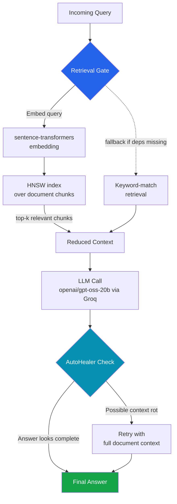
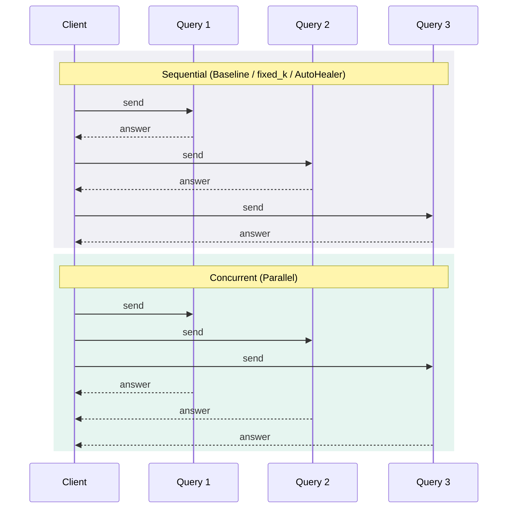
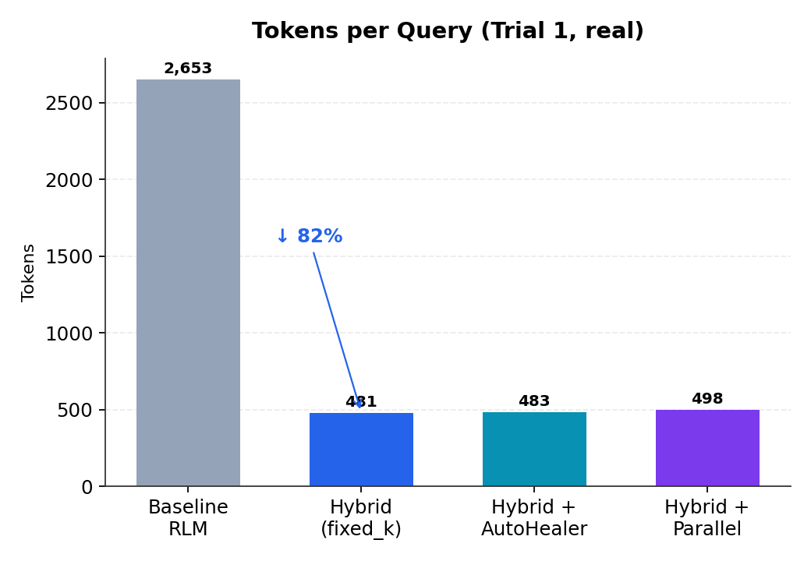
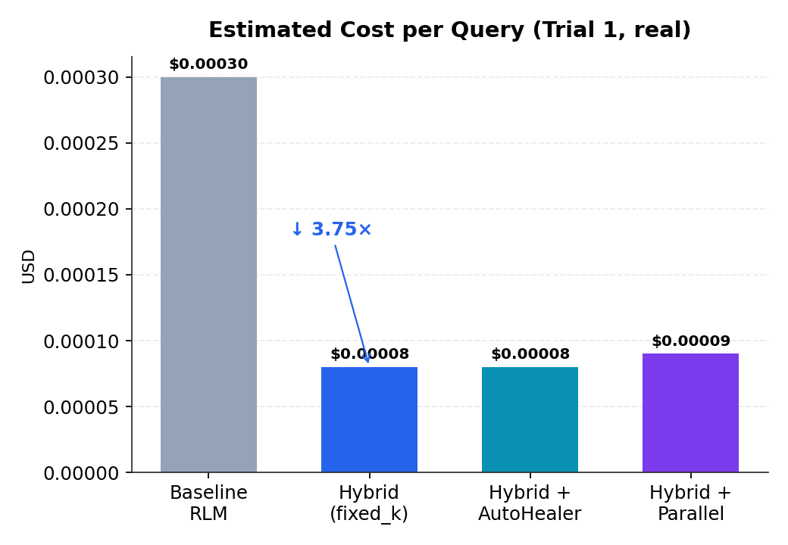
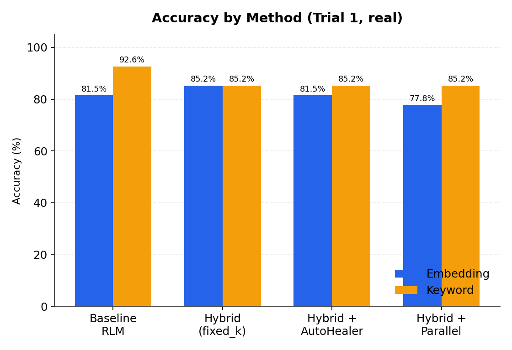
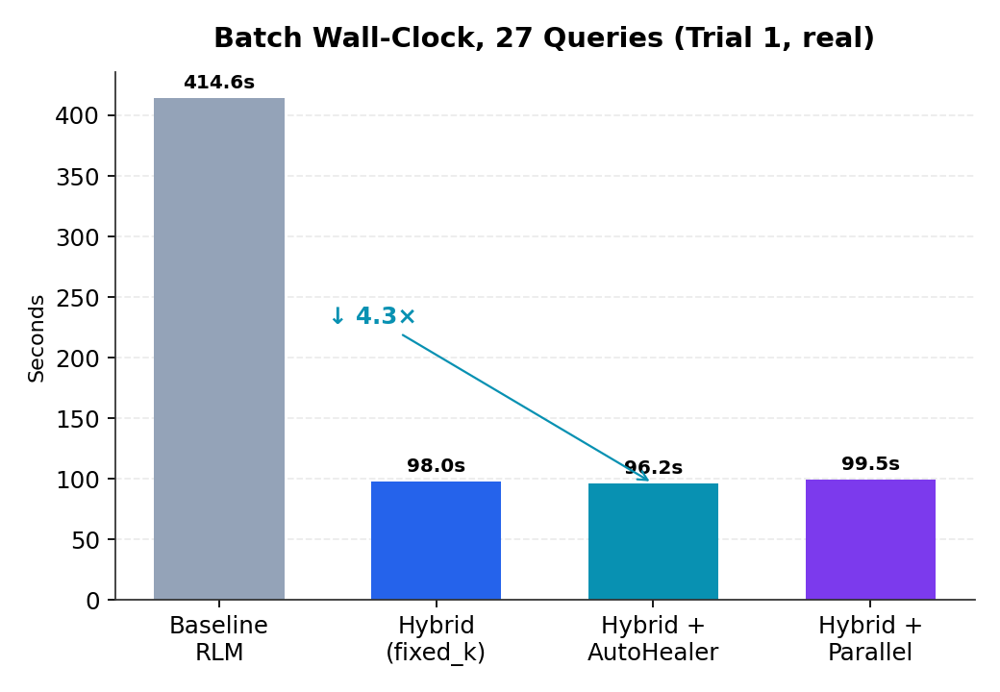

# HRA-RLM: Hybrid Retrieval-Augmented Recursive Language Model

**Cost-Efficient Long-Context Reasoning via Retrieval-Gated Recursion**

   

## Table of Contents
- [Overview](#overview)
- [Architecture](#architecture)
- [Method](#method)
- [Experimental Setup](#experimental-setup)
- [Results](#results)
- [Limitations](#limitations--threats-to-validity)
- [Reproducibility](#reproducibility)
- [Documentation](#documentation)
- [Roadmap](#roadmap)
- [Citation](#citation)

## Overview

Recursive Language Models (RLMs) improve reasoning over long documents by
iteratively re-processing context to refine an answer. This is expensive:
each pass re-consumes the full context window, driving up token usage,
latency, and inference cost as document length or reasoning depth grows.

**HRA-RLM** inserts a retrieval-gating step before each recursive pass:
instead of re-processing the full document, a retriever finds only the
passages relevant to the current sub-query via **HNSW approximate
nearest-neighbor search** over sentence-transformer embeddings, and
generation proceeds on that reduced context. An **AutoHealer** component
detects degraded ("context rot") answers and falls back to the full document
when needed.

## Architecture



**Baseline RLM** skips the retrieval gate entirely — every recursive call
receives the full document. **Hybrid (fixed_k)** always takes the top path
through the diagram above. **Hybrid + AutoHealer** adds the dashed
"possible context rot → retry" branch. **Hybrid + Parallel** runs multiple
independent instances of this same flow concurrently rather than one query
at a time:



This is why the benchmark reports **batch wall-clock time**, not just
per-query latency — per-query timing looks identical in both modes above,
but total time to clear a batch does not.

## Method

| Component | File | Role |
|---|---|---|
| Retrieval-gated recursion controller | `src/hra_rlm/retriever.py` | HNSW semantic search (sentence-transformers + hnswlib) over sentence-level chunks; falls back to keyword overlap only if those packages are unavailable |
| AutoHealer | in `benchmarks/run_benchmark.py` | Flags short/hedging answers as possible context rot and retries with full document context |
| Parallel execution pipeline | `src/hra_rlm/parallel.py` | Runs independent retrieval+generation calls concurrently; batch wall-clock timing (not just per-query latency) is used to measure the real benefit |
| LLM client | `src/hra_rlm/llm_client.py` | Groq API wrapper with dual cost reporting: `actual_cost` (real billing, $0 on Groq's free tier) and `estimated_cost` (computed against published reference pricing, so cost comparisons are meaningful) |

## Experimental Setup

- **Model:** `openai/gpt-oss-20b` via Groq (free tier). This is a reasoning
  model — it spends part of its token budget on hidden chain-of-thought
  before the visible answer, which required raising `max_tokens` to 800 to
  avoid empty responses.
- **Dataset:** 27 question–answer pairs spanning all sections of the
  project's source document, scored two ways: keyword-overlap (≥34% of
  expected keywords present) and embedding-similarity, reported side by side
  since the two metrics can disagree.
- **Retrieval:** HNSW semantic search, `top_k=3`.
- **Rate limits:** Groq's free tier enforces both a per-minute (8,000 TPM)
  and a **per-day (200,000 TPD)** token cap. A global pacer enforces ≥1s
  between calls to avoid the per-minute limit; the per-day limit means only
  **one full 4-method run currently fits in a 24-hour window** on the free
  tier — see [Limitations](#limitations--threats-to-validity).

## Results

**Trial 1 — the only trial in this run with zero mock-fallback
contamination** (all 27×4 = 108 queries received real API responses):

| Method | Acc (embedding) | Acc (keyword) | Est. cost/query | Tokens/query | Batch wall-clock (27 queries) |
|---|---|---|---|---|---|
| Baseline RLM | 81.5% | 92.6% | $0.00030 | 2653 | 414.6s |
| Hybrid (fixed_k) | 85.2% | 85.2% | $0.00008 | 481 | 98.0s |
| Hybrid + AutoHealer | 81.5% | 85.2% | $0.00008 | 483 | 96.2s |
| Hybrid + Parallel | 77.8% | 85.2% | $0.00009 | 498 | 99.5s |

<p align="center">
  
  
</p>

Retrieval gating cut average token usage by **~82%** (2653 → 481 tokens)
relative to the full-context baseline, and estimated cost per query dropped
**~3.75×** (reference pricing — Groq's free tier bills $0.00, so this is
estimated against a comparable metered model; see `REFERENCE_PRICING` in
`llm_client.py`).

<p align="center">
  
  
</p>

Accuracy is **metric-dependent**: embedding-similarity scoring shows
retrieval gating matching or slightly exceeding baseline accuracy (81.5% →
85.2%), while the stricter keyword-overlap metric shows a 7.4 percentage
point drop (92.6% → 85.2%). Both are reported rather than picking the more
favorable one. Measured as true batch wall-clock time (not per-query
latency, which does not capture concurrency benefits — see
[Architecture](#architecture)), Hybrid + AutoHealer completed the full
27-query batch **4.3× faster** than the baseline.

## Limitations & Threats to Validity

- **Single trial.** This run's later trials (2 and 3) hit Groq's free-tier
  **200,000 tokens/day** cap partway through, causing most of their queries
  to fall back to a mock/simulated answer — those trials are excluded from
  the results above. Only Trial 1 is fully real. A 27-question benchmark on
  one trial is not enough to establish statistical significance;
  multi-trial averaging is planned once daily quota allows (see Roadmap).
- **Scoring is a proxy.** Neither keyword-overlap nor embedding-similarity
  is a perfect proxy for human judgment of correctness; we report both
  because they disagree on the direction of the accuracy effect.
- **Cost is estimated, not billed.** Groq's free tier reports $0.00 for
  every call; `estimated_cost` uses reference pricing for a comparable
  metered model, clearly separated from `actual_cost` in the code.
- **Single document, single domain.** The source document is the project's
  own abstract/description (~1 page). Token-reduction percentages are
  expected to differ, likely favorably, on longer multi-passage documents —
  the setting the method is ultimately designed for — but this hasn't been
  tested yet.
- **Reasoning-model quirk.** `openai/gpt-oss-20b` spends a variable,
  sometimes large, share of its token budget on hidden reasoning before
  answering; at insufficient `max_tokens` this can produce an empty visible
  answer despite the API call "succeeding," which would show up as an
  accuracy loss unrelated to retrieval quality if not accounted for.

## Reproducibility

```bash
pip install -r requirements.txt
cp .env.example .env   # add your GROQ_API_KEY to .env — see Security note below
python benchmarks/run_benchmark.py --all --real --trials 3
```

Results are saved to `benchmarks/results/results_multi_trial.json`,
including per-trial mock-fallback counts so partially-simulated trials are
never silently mixed in with real ones.

**Security:** never commit `.env` or paste an API key into any document,
chat log, or issue. If a key is ever exposed, rotate it immediately at your
provider's console.

## Documentation

- [Methodology](./docs/METHODOLOGY.md) — architecture and how metrics are measured
- [Benchmarking guide](./docs/BENCHMARKS.md) — how to reproduce results, rate-limit constraints, data validity policy
- [Results](./docs/RESULTS.md) — current real benchmark numbers vs. original claims
- [Contributing](./CONTRIBUTING.md) — setup, workflow, and PR guidelines

## Roadmap

- [ ] Multi-trial averaging once Groq daily quota allows (or on an upgraded tier)
- [ ] Expand dataset to 50+ multi-hop QA pairs over longer, multi-passage documents
- [ ] Tune `top_k` and try alternative embedding models (`bge-small`, `all-mpnet-base-v2`) to further close the cost/accuracy trade-off
- [ ] Replace/augment keyword and embedding heuristics with an LLM-judge metric
- [ ] `pytest` coverage for `retriever.py`, `llm_client.py`, `parallel.py`

## Citation

```bibtex
@misc{hrarlm2026,
  title  = {Hybrid Retrieval-Augmented Recursive Language Model for
            Cost-Efficient Long-Context Reasoning},
  author = {Sidra},
  year   = {2026},
  note   = {Preliminary implementation and single-trial pilot evaluation.},
  url    = {https://github.com/Sidra-009/hybrid-retrieval-augmented-rlm}
}
```

Or use [`CITATION.cff`](./CITATION.cff) via GitHub's "Cite this repository" button.

---

Licensed under [MIT](./LICENSE).